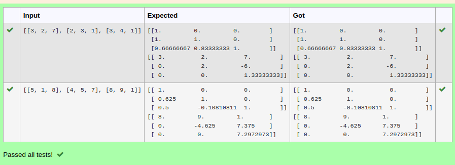
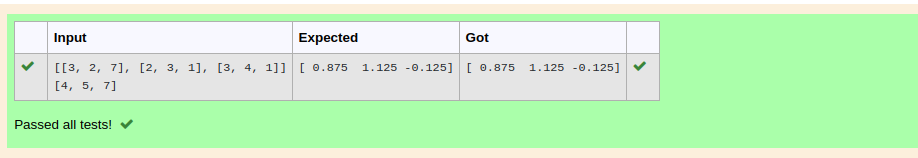

# LU Decomposition 

## AIM:
To write a program to find the LU Decomposition of a matrix.

## Equipments Required:
1. Hardware – PCs
2. Anaconda – Python 3.7 Installation / Moodle-Code Runner

## Algorithm

1. In the first step to find lu decomposition we using   import numpy as np
2. Next we using scipy.linalg for import
3. Next we settimg the variable name
4. Finally printing the value 


## Program:
(i) To find the L and U matrix
```
'''Program to find L and U matrix using LU decomposition.
Developed by: HARISH RAGAVENDRA S
RegisterNumber: 22008967
'''
import numpy as np
from scipy.linalg import lu
arr=eval(input())
A=np.array(arr)
P,L,U=lu(A)
print(L)
print(U)

```
(ii) To find the LU Decomposition of a matrix
```
/*
Program to find the LU Decomposition of a matrix.
Developed by: HARISH RAGAVENDRA S
RegisterNumber: 22008967
*/
# To print X matrix (solution to the equations)
import numpy as np
from scipy.linalg import lu_factor,lu_solve
A=np.array(eval(input()))
B=eval(input())
res=lu_factor(A)
solution=lu_solve(res,B)
print(solution)
```

## Output:




## Result:
Thus the program to find the LU Decomposition of a matrix is written and verified using python programming.

